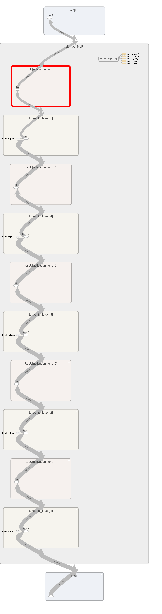

# Multi-Class Classification Using MLP
{: .no_toc}
Learn a MLP model based on the training set, and evaluate the performance on the testing set and report the learning performance.

## Table of contents
{: .no_toc .text-delta}

1. TOC
{:toc}

---
## Dataset
[dataset link hosted later](https://www.example.com)

### Dataset Size
The dataset has two files: train.csv and test.csv. They denote the pre-partitioned training set and testing set, respectively. The train.csv file has 60,000 lines, and the test.csv file has 10,000 lines. Each line represents one labeled data instance in these two files.

### Data Instance Format
For each line in the files, there are 785 elements separated by comma \
(i.e, `label,feature1,feature2,feature3,...,feature784`).

The first element denotes the label with value from {0, 1, 2, …, 9}, and the remaining 784 elements are the features of the data instance. Both the label and features are in integers.

## Abstract
Write out first program with PyTorch to implement the MLP model introduced in class. Also, utilize one of the most popular toolkits in machine learning sci-kit-learn. We learned that by using a 5-layer deep fully connected layers, we were able to reach more than 99% accuracy in training and 98% in testing. All class label predictions achieve higher than 96% in f-1 score using the testing dataset. With such a high score we suspect either the model is overtrained on the dataset and potentially overfitting. We also see that with even deeper architecture, it is not necessary to perform better than the shallower version with the same amount of epochs.

## Model
The model in our stage 2 uses simple architectures compose of only a Linear fully connected layer followed by a ReLu activation layer. Since we use CrossEntropy for our loss function, we remove SoftMax (as suggested by PyTorch documentation on Softmax) for our last layer and instead use a simple Linear fully connected layer with the same dimension with the number of output labels.

By using Jupyter Notebook and Pandas as well as Pytorch library, we found out that each entry in our data has 784 features, which means we would have a tensor of size 784 as one of our dimensions. I follow the deep learning convention and have the number of neurons in inner layers reduced by half with each layer. As a result, we were able to have 3 Linear hidden layers.

Our model uses CrossEntropy for its loss function, accompanied by the ADAM optimizer with a learning rate of 1e-3 and initial momentum of 0.9. We currently train our model on 1000 epochs with no cross-validation.
We haven’t used any layer initialization yet so it would be good if we start doing that.



## Experiment
The dataset used in the project is shown to be an image dataset. Using our Jupyter Notebook in ‘modelExploration.ipynb’, we discovered that we have 60000 entries, with each entry containing 785 columns.

Since the first column of our dataset is the label of each entry, we split the dataset into X = training set, cover from columns 1 - 784. Y = label set, which is column 0.

### Detailed Experiment Setups
{: .no_toc}
The model we use follows a simple setup of 5 fully connected linear layers, each with their respective ReLu activation function.

The details layer description is:
```py
  (fc_layer_1): Linear(in_features=784, out_features=392, bias=True)
  (activation_func_1): ReLU()
  (fc_layer_2): Linear(in_features=392, out_features=196, bias=True)
  (activation_func_2): ReLU()
  (fc_layer_3): Linear(in_features=196, out_features=98, bias=True)
  (activation_func_3): ReLU()
  (fc_layer_4): Linear(in_features=98, out_features=49, bias=True)
  (activation_func_4): ReLU()
  (fc_layer_5): Linear(in_features=49, out_features=10, bias=True)
  (activation_func_5): ReLU()
```
We didn’t use softmax as our last layer because PyTorch documentation recommends against it if we use CrossEntropyLoss() for our loss calculations.
We modified the Method_MLP class using OrderedDict() to organize our layers so that we can easily add more hidden layers and gather training data on different architectures more effectively.

For our hyperparameters, we have our learning rate at 1e-4 and our momentum at 0.9. We train our model with 1000 epochs and set the manual random seed to 42. We currently don’t use any special initialization method for the weight in our layer and rely on the default Linear layer default initialization. The default initialization for linear layer weight is kaiming_uniform() while the bias uses uniform() initialization.

We currently don’t have any different settings for testing and training aside from turning off gradient propagation when we use the testing data set.

## Evaluation Metrics
We use the scikit-learn library’s classification_report() function to report F1, Accuracy, precision, and recall when using our test dataset.

### Training Convergence Plot


### Performance Output
The performance log for our main model: 
```py
--start training...
evaluating performance...
Epoch: 0 Accuracy: 0.0761 Loss: 2.593773603439331
evaluating performance...
Epoch: 100 Accuracy: 0.9554666666666667 Loss: 0.16091014444828033
evaluating performance...
Epoch: 200 Accuracy: 0.9833 Loss: 0.06655079871416092
evaluating performance...
Epoch: 300 Accuracy: 0.9942666666666666 Loss: 0.029909998178482056
evaluating performance...
Epoch: 400 Accuracy: 0.9984166666666666 Loss: 0.014028253965079784
evaluating performance...
Epoch: 500 Accuracy: 0.9994 Loss: 0.007439898326992989
evaluating performance...
Epoch: 600 Accuracy: 0.99945 Loss: 0.004539367277175188
evaluating performance...
Epoch: 700 Accuracy: 0.9995833333333334 Loss: 0.0030404329299926758
evaluating performance...
Epoch: 800 Accuracy: 0.9996666666666667 Loss: 0.0022625657729804516
evaluating performance...
Epoch: 900 Accuracy: 0.99965 Loss: 0.0018424532609060407
--start testing...
run performace metrics:
          	        precision  recall  f1-score   support

       	0   	0.98  	0.99  	0.98   	980
       	1   	0.99  	0.99  	0.99  	1135
       	2   	0.98  	0.97  	0.97  	1032
       	3   	0.98  	0.98  	0.98  	1010
       	4   	0.98  	0.97  	0.97   	982
       	5   	0.97  	0.97  	0.97   	892
       	6   	0.98  	0.97  	0.98   	958
       	7   	0.98  	0.98  	0.98  	1028
       	8   	0.97  	0.97  	0.97   	974
       	9   	0.97  	0.97  	0.97  	1009

accuracy                       	0.98 	10000
macro avg   	0.98  	0.98  	0.98 	10000
weighted avg   	0.98  	0.98  	0.98 	10000

evaluating performance...
saving results...
saving models...
Accuracy is: 97.61999999999999%
```

## Ablation Studies
### With 6 hidden layers (all linears)
{: .no_toc}
```py
 precision  recall  f1-score   support

       	0   	0.35  	0.98  	0.51   	980
       	1   	0.98  	0.99  	0.99  	1135
       	2   	0.95  	0.98  	0.96  	1032
       	3   	0.00  	0.00  	0.00  	1010
       	4   	0.96  	0.98  	0.97   	982
       	5   	0.92  	0.98  	0.95   	892
       	6   	0.96  	0.98  	0.97   	958
       	7   	0.96  	0.98  	0.97  	1028
       	8   	0.00  	0.00  	0.00   	974
       	9   	0.96  	0.98  	0.97  	1009

accuracy                       	0.79 	10000
macro avg   	0.70  	0.78  	0.73 	10000
weighted avg   	0.71  	0.79  	0.73 	10000

evaluating performance...
saving results...
saving models...
evaluating performance...
Accuracy is: 78.64%
The model architecture is:
  (fc_layer_1): Linear(in_features=784, out_features=392, bias=True)
  (activation_func_1): ReLU()
  (fc_layer_2): Linear(in_features=392, out_features=294, bias=True)
  (activation_func_2): ReLU()
  (fc_layer_3): Linear(in_features=294, out_features=196, bias=True)
  (activation_func_3): ReLU()
  (fc_layer_4): Linear(in_features=196, out_features=49, bias=True)
  (activation_func_4): ReLU()
  (fc_layer_5): Linear(in_features=49, out_features=20, bias=True)
  (activation_func_5): ReLU()
  (fc_layer_6): Linear(in_features=20, out_features=10, bias=True)
  (activation_func_6): ReLU()
```
### Comparision between 2 models
{: .no_toc}
Comparison loss and accuracy graph on two model architectures, using 1000 epochs, learning rate of 1e-4, CrossEntropyLoss, and with random seed of 42.


> Orange: the original model, with 5 fully connected layers
>
> Blue: 6 fully connected layers
