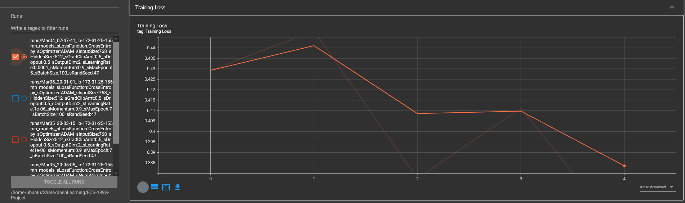

# Text Classification and Text Generation using Recurrent Neural Network
{: .no_toc}
Cleaned the text data, removed stop words and punctuations and also normalized the words. Extracted the vocabulary set from the provided data. Trained a RNN model to classify the documents into either positive or negative classes with the training set.

Trained a RNN model, which can generate the whole piece of a sentence based on a given input of the beginning three words.

## Table of contents
{: .no_toc .text-delta}

1. TOC
{:toc}

## Dataset
[Text Classification and Text Generation dataset](https://drive.google.com/drive/folders/1u7Goass-WixLkL7nCWYL7LeI6cfZd1S1?usp=sharing)

This dataset contains movie reviews along with their associated binary
sentiment polarity labels. It is intended to serve as a benchmark for
sentiment classification. This document outlines how the dataset was
gathered, and how to use the files provided. 

### Text Classification
The core dataset contains 50,000 reviews split evenly into 25k train
and 25k test sets. The overall distribution of labels is balanced (25k
pos and 25k neg).

In the entire collection, no more than 30 reviews are allowed for any
given movie because reviews for the same movie tend to have correlated
ratings. Further, the train and test sets contain a disjoint set of
movies, so no significant performance is obtained by memorizing
movie-unique terms and their associated with observed labels.  In the
labeled train/test sets, a negative review has a score <= 4 out of 10,
and a positive review has a score >= 7 out of 10. Thus reviews with
more neutral ratings are not included in the train/test sets.

#### Dataset Organization
{: .no_toc}
There are two top-level directories `[train/, test/]` corresponding to
the training and test sets. Each contains `[pos/, neg/]` directories for
the reviews with binary labels positive and negative. Within these
directories, reviews are stored in text files named following the
convention `[[id]_[rating].txt]` where `[id]` is a unique id and `[rating]` is
the star rating for that review on a 1-10 scale. For example, the file
`[test/pos/200_8.txt]` is the text for a positive-labeled test set
example with unique id 200 and star rating 8/10 from IMDb.

### Text Generation
The dataset contains 1622 pieces of short jokes. Each joke on a new line in the `data` file.

## Abstract
Familiarized with the recurrent neural network (RNN) model, and used the model to classify and generate text data. First, we cleaned the dataset given and then tokenized before passing the data through BERT embedding. Next, we use the Pytorch library to train RNN models by passing in the BERT embedding into it. To test for classification, we could compare the expected output. However, for the generation component, we tested it with our own input.

## Model
Our classification model uses a Recurrent Neural Network layer, Flatten layer, a Linear layer, and finally a Sigmoid layer.  We also use mini-batch in all our training as the data has lots of data points and we would run out of memory otherwise. For the text generation task, our model uses an Embedding Layer, an LTSM layer, and a Linear Layer with ReLu to generate the next word using a 3-word input. We don’t use a mini-batch for our generation model since there is not a lot of data compared to the classification model.

### Classification Model


### Generator Model


## Text Classification Experiment
There are two datasets for this stage. The dataset for text classification contains text files of movie reviews, with their sentiment data included in the form of binary polarity labels. There are 50,000 reviews in total, split evenly between a training set and a test set. These collections are also split in half to separate the movie reviews with a negative sentiment score and those with a positive sentiment score. 

The dataset has been cleaned from html tags, made universally lowercase, and tokenized using Bert Tokenizer. Since tokenizing huge amounts of data takes a long time, we save the tokenized result and load it when we need to embed the token through BERT. The embedded tensor after passing through BERT got shape of `(batch number * input size * sequence length)`.

The input size is 768 since BERT uses a vector of size 768 to represent the embedded word. Sequence length is 512 since BERT only take a maximum sentence length of 512. We chose to use the last 512 words of each review since we intuitively believe that later sentences give more meaning than the beginnings.

### Detailed Experiment Setups
{: .no_toc}
```
--network status--
===================================================================================
Layer (type:depth-idx)                   Output Shape              	Param #
===================================================================================
Method_Classification                     [100, 2]			109,482,240
├─ModuleDict: 1-1                        	--                        		--
│    └─RNN: 2-1                          	[100, 512, 512]          	 656,384
│    └─Flatten: 2-2                     	[100, 262144]            	 --
│    └─Linear: 2-3                       	[100, 2]                 	524,290
│    └─Sigmoid: 2-4                     	[100, 2]                		 --
===================================================================================
Total params: 110,662,914
Trainable params: 110,662,914
Non-trainable params: 0
Total mult-adds (G): 33.66
===================================================================================
Input size (MB): 157.29
Forward/backward pass size (MB): 209.72
Params size (MB): 4.72
Estimated Total Size (MB): 371.73
===================================================================================
```
With the huge amount of data we process, we could not use the whole training set to train in one go and have to break the data into smaller batches. We meet many challenges in finding a good middle point with batch size, number of epochs and training time. Since embedding our data using BERT takes a long time, we arrive at using a batch size of 100 with 5 epochs. On average, each epoch takes 15 mins to pass through every data. Therefore, we figure an hour of each training run is a good middle ground.

Aside from time constraint, we use a learning rate of 1e-4 and momentum of 0.9. Despite a simple architecture of only one RNN layer in our model, we made up with using a large hidden layer size of 512. Since we have to train the model for such a long time, we also utilize the `tqdm` library to show the model progress and record our training timeline. It was also due to `tqdm` that we recognize the low memory problem we have and are able to make the change to mini batches quickly.


## Text Generation Experiment
The dataset for text generation contains 1622 text files of short jokes to train our RNN model to generate jokes when given input of the first three words. We cleaned the data similar to the text classification model, but also add `<EOS>` tag at the end of each sentence.

We then build our vocabulary and tokenizer `torchtext.build_vocab_from_iterator()` and `nltk.word_tokenizer()`. Using the above, we find all sequences of contiguous text with length of 4. From this list of sequences, we create input as a list of words of length 3, and use the 4th word as our ground truth. We then tokenized the input and output using the tokenizer to get their word index representation into tensor.

The input tensor has the shape of `(sequence length * input size)` where the sequence length is 9616 since that’s how many contiguous words sequence of length 4 can be found in our data. The input size is 3 representing the 3 word index we will input into our model. Our output is a probability vector of size 4330, which is the size of our vocabulary and represents the chance for what the 4th word is going to be.

### Detailed Experiment Setups
{: .no_toc}
```
===================================================================================
Layer (type:depth-idx)               		Output Shape          	Param #
===================================================================================
Method_Generation                    		[9616, 4330]          	--
├─ModuleDict: 1-1                    		--                    		--
│	└─Embedding: 2-1                	[9616, 3, 4330]       	41,637,280
│	└─LSTM: 2-2                     	[9616, 3, 50]         	876,400
│	└─extract_tensorLTSM: 2-3       	[9616, 50]            		--
│	└─Linear: 2-4                   		[9616, 4330]          	220,830
│	└─ReLU: 2-5                     	[9616, 4330]          	--
===================================================================================
Total params: 42,734,510
Trainable params: 42,734,510
Non-trainable params: 0
Total mult-adds (G): 427.79
===================================================================================
Input size (MB): 0.23
Forward/backward pass size (MB): 1343.93
Params size (MB): 170.94
Estimated Total Size (MB): 1515.10
===================================================================================
```
Since we have much less data to work with, we can train the generation language model using the full batch method. We also decided to use the LSTM layer to see if there is a difference in training the model. Our input for the model will be a sequence of 3 words and the output is the model prediction of the 4th word. Since we don’t use the BERT embedding, we also didn’t suffer through the long wait time of passing our input through BERT embedding.

We use 500 epochs with a hidden size of 50 in our LSTM layer. Since there is no testing set for text generation, we have to test the model by ourselves. We created `useGeneration.py` as a script to test our language model output by using any 3 words entered by the user. The input is cleaned and tokenized just like how we preprocess the data in normal training. The user is then truncated or padded accordingly to fit the 3 word requirement.

We then load the tokenizer and the model used before and tokenize the input and pass through the trained model to get the next word. We then concatenate the new word into our output string and get the new set of 3 words and pass it through the model once again. The process keeps going until our model returns the `<EOS>` as the output word.

## Evaluation Metrics
We use scikit-learn library’s `classification_report()` function to report F1, Accuracy, precision and recall when using our test dataset.

### Classifier Training Result

Classifier Performance
```
--start training…
Epoch: 0 Accuracy: 0.88 Loss: 0.4292556345462799
Epoch: 1 Accuracy: 0.89 Loss: 0.4481630027294159 
Epoch: 2 Accuracy: 0.95 Loss: 0.3774507939815521
Epoch: 3 Accuracy: 0.9 Loss: 0.4111271798610687
Epoch: 4 Accuracy: 0.97 Loss: 0.34942764043807983
--start testing...
run performance metrics:
              precision    recall  f1-score   support
           0       0.87      0.88      0.88     12500
           1       0.88      0.86      0.87     12500

accuracy                      0.87     25000
macro avg       0.87      0.87      0.87     25000
weighted avg   0.87      0.87      0.87     25000

saving models...
Accuracy is: 87.388%
```

### Generator Training Result

```
--start training...
Epoch: 0 Accuracy: 0.00021522733387140168 Loss: 8.391127586364746
Epoch: 50 Accuracy: 0.21678773204196933 Loss: 6.131967544555664
…
Epoch: 400 Accuracy: 0.846381490449287 Loss: 1.4322865009307861
Epoch: 450 Accuracy: 0.8661285983319882 Loss: 1.3105754852294922
run performance metrics: 
              precision    recall  f1-score   support
           2       0.74      0.97      0.84      1030
           3       0.76      0.95      0.85       799
           4       0.88      0.93      0.90        55
…
        4366       0.00      0.00      0.00         1
        4367       1.00      1.00      1.00         1

    accuracy                           0.88     18585
   macro avg       0.71      0.69      0.69     18585
weighted avg       0.82      0.88      0.84     18585

saving models...
Accuracy is: 87.94188861985472%
```

## Ablation Studies
We tried multiple batch sizes to see if there is any difference in training performance. There seem to be no significant changes aside from the time it takes to finish one epoch. With a batch size of 250, 1 epoch takes us 16 minutes while with our initial pick of 100, it took us only 14 mins.

We also tested out saving the embedded vector first before passing it through our model to save some time from having to re-embedding text every time we trained the model. However, our system crashes whenever we try to pickle the embedded vector. We found out that we didn’t have enough memory to save the whole embedded tensor into a file, thus we have to do tokenizing, embedding, and passing through our model all in batches.

## Source Code
GitHub repository page: [https://github.com/CyberExplosion/Deep-Learning-Projects/tree/P4](https://github.com/CyberExplosion/Deep-Learning-Projects/tree/P4)